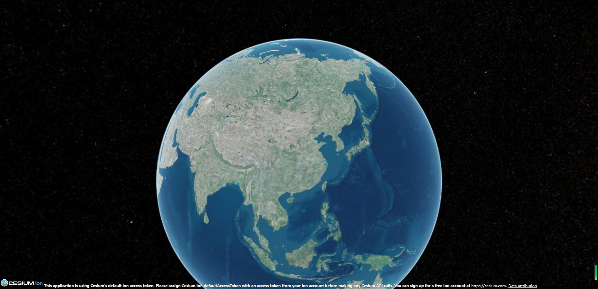

# skys3D-vue-template

## 介绍📖
快速启动一个Vue3+Cesium工程化项目

## run
```
# 安装本地依赖
pnpm install

启动本地
# pnpm run dev
```
## build
```
# 打包测试环境
pnpm run build:test

# 打包运行环境
pnpm run build:pro

# 打包生产环境
pnpm run build:dev
```
## Package🔨

- 使用Vite5.xx+ Vue3开发,单文件组件**＜script setup＞**
- 使用 Pinia进行持久化操作
- 使用ElementPlus绘制UI
- Turf.js
- d3.js

## 展示
- 
